# Google Summer of Code 2026: Final Work Submission Report

## Incremental Global Routing on CUGR

**Organization:** OpenROAD / FOSSi Foundation
**Contributor:** Sparsh Karna (github.com/sparsh-karna)
**Mentor:** Eder Monteiro
**Project size:** Large (350 hours)
**Submission date:** August 24, 2026
**Repository:** The-OpenROAD-Project/OpenROAD
**Fork:** github.com/sparsh-karna/OpenROAD

---

## 1. Executive Summary

This report summarizes the work completed during GSoC 2026 for the OpenROAD project under the proposal "Incremental Global Routing on CUGR." The project's goal was to bring CUGR, OpenROAD's routability-driven global router, to feature parity with FastRoute's incremental (ECO-triggered) routing capability, so that CUGR can be used inside the day-to-day repair_timing / recover_power / repair_antennas flow without paying the cost of a full re-route after every small netlist change.

Over the course of the program, five pull requests were opened against the upstream OpenROAD repository, all of which have been reviewed and merged by mentor Eder Monteiro. Together they take CUGR from having no incremental capability at all to a state where it automatically tracks ODB database callbacks (net creation, net deletion, instance moves, master swaps, and net merges) and reroutes only the affected nets, mirroring FastRoute's existing behavior. The work was validated with new GRT regression tests and with an end-to-end benchmarking sweep across 65 designs spanning seven PDKs (asap7, nangate45, sky130hd, sky130hs, gf180, ihp-sg13g2, gt2n) comparing CUGR against FastRoute on timing, power, area, and buffer-insertion metrics.

The remaining gap identified by this benchmarking, a small number of designs (notably on sky130hd/hs and the gt2n outlier) where CUGR's incremental detour-penalty tuning still needs work, is documented below as follow-on work for the OpenROAD community.

---

## 2. Background and Problem Statement

OpenROAD's global routing module (`src/grt`) supports two backends: FastRoute, the long-standing default, and CUGR, a routability-driven router from CUHK that is toggled via `-use_cugr` and optimizes guide rectangles to minimize downstream DRC violations. CUGR's routability advantage was integrated into OpenROAD without the incremental routing capability that FastRoute already had.

Without incremental support, CUGR had to re-route the entire design from scratch after any netlist or placement change, a process that can take tens of minutes on large industrial designs. In the OpenROAD flow, incremental global routing is triggered by a family of Engineering Change Order (ECO) operations that each modify only a subset of nets: gate up/down-sizing (`inDbInstSwapMasterAfter`), instance movement / placement legalisation (`inDbPostMoveInst`), buffer insertion and removal (`inDbITermPostConnect` / `inDbITermPreDisconnect`), and net creation/destruction (`inDbNetCreate` / `inDbNetDestroy`). These callbacks are managed by the `IncrementalGRoute` class, which populates a `dirty_nets_` set in `GlobalRouter`.

Before this project, CUGR had no `use_cugr_` branches in these callback paths, no mechanism to refresh stale GRNet/CUGRNet topology after an ECO, and no way to register brand-new nets or clean up deleted ones. Three concrete failure modes motivated the work:

- `addDirtyNet` silently dropped ECO-modified nets, because `db_net_map_` had no entry for nets created after CUGR's initial `readNetlist()` pass.
- Stale topology after an ECO: GRNet pin lists, access points and bounding boxes stayed frozen at initialisation time, so any incremental reroute on that state produced incorrect guides.
- No GlobalRouter integration: `use_cugr_` branches were entirely absent from `GlobalRouter::startIncremental()`/`endIncremental()`, so CUGR was never invoked on the incremental path regardless of which backend was active.

---

## 3. Summary of Contributions

All five pull requests listed in the original proposal and its subsequent extensions have been merged into master.

| PR | Title | Status | Core changes |
|---|---|---|---|
| [#9671](https://github.com/The-OpenROAD-Project/OpenROAD/pull/9671) | Topology Refresh (updateNet) | Merged | `Design::makeNetPins` / `updateNet`, `CUGR::updateNet`, null guards in GridGraph/GRTree |
| [#9759](https://github.com/The-OpenROAD-Project/OpenROAD/pull/9759) | Queue-and-Execute Refactor | Merged | `nets_to_route_` vector queue, unified `route()`/`routeIncremental()` pipeline, secondary-overflow resolution |
| [#10578](https://github.com/The-OpenROAD-Project/OpenROAD/pull/10578) | Incremental Deleted-Net Cleanup | Merged | `CUGR::removeNet`, `GlobalRouter::removeNet`, invalidation-based net removal, unordered_map lookups |
| [#10648](https://github.com/The-OpenROAD-Project/OpenROAD/pull/10648) | Regression Test for Deleted-Net Handling | Merged | `incremental_deleted_net.tcl`, `grt::add_dirty_net` Tcl binding, CMake/Bazel registration |
| [#10683](https://github.com/The-OpenROAD-Project/OpenROAD/pull/10683) | Automatic ODB-Callback Wiring for CUGR + CI Log Fix | Merged | Fully automatic dirty-net to updateNet wiring, `mergeNetsRouting` hook, defensive init checks, RSZ CI log-noise fix |

Two additional pre-GSoC PRs (#9645, an early core-API attempt superseded by #9671, and #9866, a documentation contribution generating LEF/DEF grammar railroad diagrams) established the applicant's familiarity with the codebase and review process but are not part of the GSoC coding period deliverables; they are described in the original proposal for context.

---

## 4. Detailed Pull Request Descriptions

### 4.1 PR #9671: Topology Refresh (updateNet)

**Status:** Merged. 13 files changed, 330 insertions / 44 deletions.

This PR solves the stale-state problem at the heart of CUGR's incremental gap: after any ECO operation, the GRNet (CUGR layer) and CUGRNet (Design layer) objects that represent a net hold pin lists and bounding boxes that were frozen at initialisation and no longer match ODB.

**Key changes:**

- `Design::makeNetPins(dbNet*)`, a new shared helper that reads all `dbBTerm`/`dbITerm` entries for a net, applies instance transforms, and returns a `std::vector<CUGRPin>`. It is used by both the original `readNetlist()` path and the new incremental path, eliminating duplicated pin-reading logic.
- `Design::updateNet(dbNet*)`, backed by an O(1) `db_net_to_id_` (`std::unordered_map<dbNet*, int>`) lookup, refreshes topology in place for existing nets and appends a brand-new CUGRNet entry for nets that did not exist at initialisation (e.g. the sub-net created by a buffer insertion).
- `CUGR::updateNet`: rips up the net's old routing tree via `commitTree(..., ripup=true)`, rebuilds the GRNet (access points, bounding box, terminal maps), and automatically queues the net for rerouting when incremental mode is active.
- Null guards added in `GridGraph::commitTree` and `GRTree::preorder`, scoped to the incremental context, to prevent a crash on freshly-created GRNets that have no routing tree yet.
- New regression test `incremental_update_net.tcl`: splits a net, calls the (at-the-time) Tcl entry point on both halves, runs `-end_incremental`, and asserts routing guides exist for the new net.

The PR went through three rounds of review before being approved and merged by Eder Monteiro.

### 4.2 PR #9759: Queue-and-Execute Refactor

**Status:** Merged. 31 insertions / 57 deletions across CUGR.h, CUGR.cpp, GlobalRouter.cpp.

Replaces the previous `dirty_net_indices_` (`std::set<int>`) and a separate `incremental_mode_` boolean flag with a single `nets_to_route_` (`std::vector<int>`) queue, explicitly mirroring FastRoute's `netids` vector, per Eder's review guidance, so both backends share the same mental model for incremental state.

**Key changes:**

- `CUGR::route()` branches on queue state at entry: an empty queue means collect every `gr_nets_` index and run a full route; a non-empty queue is treated as a dirty-only list and triggers an incremental route.
- Both paths execute the identical three-stage pipeline (`patternRoute` to `patternRouteWithDetours` to `mazeRoute`) with no duplicated code, so incremental routes get the same routability-aware quality as a full route.
- `routeIncremental()` snapshots the initial dirty set, calls `route()`, then uses `std::ranges::set_difference` to compute secondary overflow nets (nets whose congestion changed as a side effect of rerouting the dirty set) and calls `route()` once more on those, an O(n log m) replacement for the original O(n) loop.
- `addDirtyNet` now calls `removeTreeUsage()` before pushing a net onto the queue, so the old tree's edge-usage is decremented prior to rip-up.
- A redundant `std::ranges::unique` call flagged in review was removed, since de-duplication is already handled upstream by GlobalRouter's `dirty_nets_` `std::set`.

All 15 CI checks passed and the PR was merged by eder-matheus.

### 4.3 PR #10578: Incremental Deleted-Net Cleanup for CUGR

**Status:** Merged. 15 commits, reviewed by Gemini Code Assist, Codex, and Eder Monteiro.

ECO operations such as buffer removal and gate downsizing can delete a net entirely, not just modify it. Before this PR, a deleted net left its edge usage behind in GridGraph, causing phantom congestion on every subsequent routing pass. This PR implements `CUGR::removeNet(odb::dbNet*)` and wires it behind the existing `inDbNetDestroy` ODB callback.

**Key changes and review-driven iterations:**

- `removeNet` calls `removeTreeUsage()` to synchronously decrement all edge capacities held by the deleted net's routing tree, then erases the net's entries from CUGR's internal maps, and calls `Design::removeNet` to drop the corresponding CUGRNet.
- Dangling-pointer fix: the initial design used a deferred `pending_deleted_nets_` queue. Gemini Code Assist's review flagged this as a dangling-pointer hazard because ODB may reuse the pointer before the queue is drained. The design was changed to process net removal synchronously inside `inDbNetDestroy` instead.
- Performance: `std::map` lookups in CUGR were switched to `std::unordered_map` for O(1) net lookups, and `std::move` was used for pin vectors in `Design::removeNet` to avoid expensive deep copies, per review feedback.
- Encapsulation: the removal logic was moved out of the ODB callback (`GRouteDbCbk`) and centralized in a new `GlobalRouter::removeNet`, which dispatches to either the FastRoute or CUGR path and is now the single entry point for net-destroy handling for both engines, with added null-safety checks.
- Final optimization: rather than rebuilding CUGR's net vectors on every deletion (an O(n) operation), the implementation was switched to an invalidation scheme, matching FastRoute's own approach, where deleted nets are marked invalid in place via a new `isValid()` check, and CUGRNet/CUGRPin `index_` fields were made non-const to support this move/reassignment pattern.
- A follow-up commit fixed a bug where Net-Delay-Reduction (NDR) routing costs were not being passed to `removeTreeUsage()` inside `CUGR::removeNet`, which could under-count edge usage decrements for NDR nets.
- Final cleanup addressed clang-tidy `readability-container-contains` warnings by replacing `find()!=end()`/`count()` patterns with `.contains()`.

The PR was approved and merged by eder-matheus after the dangling-pointer hazard was resolved and all 16 CI checks passed.

### 4.4 PR #10648: Regression Test for Incremental Deleted-Net Handling

**Status:** Merged. 5 commits.

Adds the regression test that validates the behavior implemented in #10578. The test (`src/grt/test/incremental_deleted_net.tcl`) routes a small design (`remove_buffers1.def`) with CUGR, enters an incremental session, manually inserts a buffer via the ODB API (creating an intermediate net `n_extra`), deletes that buffer and `n_extra` to restore the original connectivity, marks the surviving net dirty, ends the incremental session, and asserts that `n_extra` is absent from the final routing guides.

**Review-driven corrections:**

- A Gemini Code Assist review flagged a missing null check in the new `grt::add_dirty_net` Tcl wrapper (exposed via `GlobalRouter.i`), and an inaccurate error message when the `BUF_X1` master cell lookup failed; both were corrected.
- A Codex review caught that the new test was registered only in the CMake regression list and not in `src/grt/test/BUILD`, meaning Bazel-based CI would silently skip the deleted-net coverage; this was fixed by registering the test in Bazel as well.
- A subtler bug, caught by Codex and confirmed by Eder Monteiro, was that `GlobalRouter.tcl` resets `use_cugr_` on every `global_route` invocation. Because the test originally omitted `-use_cugr` on the `-start_incremental`/`-end_incremental` calls, the buffer creation/deletion inside the incremental bracket was silently taking the non-CUGR `removeNet` path, meaning the test could pass without actually exercising the CUGR deleted-net code it was written to cover. This was fixed by passing `-use_cugr` through both incremental calls.

After the CUGR-mode-correctness fix, `ctest -R incremental_deleted_net -V` was verified locally (test #7198, 100% pass), and the PR was approved and merged.

### 4.5 PR #10683: Automatic ODB-Callback Wiring for CUGR + CI Log Fix

**Status:** Merged. 16 commits, the largest and final PR of the incremental-CUGR work.

This PR is the capstone of the project: it removes the need for any manual Tcl calls to drive CUGR's incremental state and makes structural database changes (instance moves, master swaps, connectivity updates) automatically trigger topology refresh and rerouting in CUGR, bringing it to full feature parity with FastRoute's automatic incremental flow.

**Key changes:**

- Automatic topology refresh: `GlobalRouter::addDirtyNet` now itself calls `cugr_->updateNet(net)`, so any event that marks a net dirty (e.g. moving an instance) also refreshes CUGR's internal pin and obstruction maps without a separate call.
- Net-merge fallback: a CUGR hook was added inside `GlobalRouter::mergeNetsRouting` that marks the affected nets dirty so they are picked up on the next incremental update.
- Robust initialization: defensive checks were added across `addDirtyNet`, `updateNet`, and `removeNet` to gracefully handle ODB callbacks that can fire before the global router is fully initialized.
- API cleanup: the temporary `grt::add_dirty_net` and `grt::update_cugr_net` Tcl/SWIG functions introduced in earlier PRs (needed only because the wiring was manual) were removed, along with the now-redundant `GlobalRouter::updateCUGRNet` C++ method.
- CI fix: non-deterministic "Runtime: {:.2f}s" log lines in RSZ Python tests were suppressed, resolving intermittent Jenkins CI failures caused by golden-file mismatches.

**Bugs found and fixed during review:**

- Codex flagged (P1) that refreshing CUGR on `inDbITermPreDisconnect` happens before ODB unlinks the terminal, and that there is no corresponding post-disconnect callback in `GRouteDbCbk`, so disconnecting one sink from a multi-sink net could refresh CUGR with a stale pin list and route/write guides to a pin that no longer exists. This was fixed by deferring the CUGR `updateNet` call to `updateDirtyRoutes()`, matching how FastRoute defers its own pin refresh.
- Codex flagged (P2) that calling `CUGR::updateNet` immediately on `inDbNetCreate` registers an essentially empty net (no pins yet) in the Design layer without a GRNet, which could cause a later net's post-connect refresh to route the wrong newly-created net if multiple nets are created before their terminals are attached. This was fixed by deferring CUGR net registration until terminals are actually connected.
- A `GlobalRouter.tcl` bug was found where the `global_route` Tcl proc unconditionally reset `use_cugr_` on every invocation, including the `-start_incremental`/`-end_incremental` calls, which could silently flip `endIncremental()` onto the (uninitialised) FastRoute code path and trigger a GRT-0229 crash; fixed by skipping the reset while inside an incremental bracket.
- A missing GRT-0300 log message was traced to the CUGR init path skipping `configFastRoute()`. `initCUGR()` (later renamed `initRoutingGrid()` to accurately reflect that it only sets up routing-grid state shared by both engines) was updated to call `configFastRoute()` first, restoring correct log ordering and fixing log-compare regression failures.
- A duplicate routing-statistics block in the log, caused by `routeIncremental()` calling `printStatistics()` explicitly on top of the call already made inside `route()`, was removed.
- A new integration test, `incremental_repair_cugr.tcl`, was added exercising `repair_design` and `repair_timing` inside a CUGR incremental session, with its own golden `.ok` file, per Eder's request for concrete log-level coverage of the fully-automatic flow.

All GRT and RSZ regression tests were verified to pass via `ctest`, and the PR was approved and merged by eder-matheus, closing out the core incremental-CUGR objective set out in the original proposal.

---

## 5. Weekly Progress Overview

| Week | Focus |
|---|---|
| 2 (Jun 1) | VM/build environment setup; studied `addDirtyNet`/`startIncremental`/`endIncremental` interaction; identified that `endIncremental` routed stale GRNet objects after buffer insertion as the core gap. |
| 3 (Jun 8) | Implemented incremental net deletion (`removeNet`); opened the predecessor test to PR #10648; iteratively fixed CI failures (hallucinated ODB API, GRT message-ID conflicts, tclint formatting). |
| 4 (Jun 16) | Consolidated CUGR init (`initCUGR`), stripped `configFastRoute()` from the CUGR pipeline, added `incremental_repair_cugr.tcl` integration test, resolved CI/Bazel/CMake regression-list issues. |
| 5 (Jun 23) | Deployed the incremental CUGR build on real ORFS designs; sanitized the execution path to remove inadvertent FastRoute API calls; validated nangate45/gcd end to end. |
| 6 (Jun 30) | Found and fixed a dirty-net regression where CUGR failed to detect pin-coordinate shifts on the grid, causing redundant rerouting; implemented spatial diffing to skip rerouting for nets with static pins; completed midterm evaluations. |
| 7 to 8 (Jul 7 to 14) | Implemented net-merging in CUGR (`mergeNetsRouting`) mirroring FastRoute's incremental logic; validated ECO buffer add/delete without full GR re-init; added `remove_buffers1/2/3_cugr` integration tests; addressed all upstream PR feedback and rebased onto master (149/149 GRT tests passing). |
| 9 (Jul 28) | Ran the full CUGR-vs-FastRoute comparison sweep across 10 designs (ariane133, microwatt, cva6, swerv_wrapper, ethmac, jpeg, ibex, aes, riscv32i) and extracted setup/hold WS/TNS and detailed-route wirelength deltas for global-route and finish stages. |
| 10 (Aug 4) | Generated the first round of CUGR-vs-FastRoute comparison plots; planned repair_antenna support for CUGR and a re-run once implemented. |
| 11 (Aug 11) | Wrote up the placement-vs-routing timing-repair history for ORFS (wire-load-model to Steiner-tree to routed-layer parasitic estimation) motivating why post-GRT incremental repair with CUGR is materially more accurate than placement-stage repair. |
| 12 (Aug 18) | Final benchmarking sweep across 65 designs / 7 PDKs; compiled the DRC/timing verdict matrix and per-node findings included in Section 7; assembled this final report. |

---

## 6. Required Task: ORFS Verification

As required by the proposal, the `nangate45/gcd` example was run end to end through the OpenROAD-flow-scripts RTL-to-GDS flow on a Lightning Cloud Ubuntu 24.04 LTS instance (AMD EPYC 7B13, 4 vCPUs, 15 GB RAM) after a local macOS/OrbStack build was abandoned due to Rosetta 2 / ARM64 ABI incompatibilities that caused LTO linker crashes, a known upstream issue on Apple Silicon. `setup.sh` and `build_openroad.sh -local` completed cleanly on the cloud instance, and the full flow finished without errors, producing the required `logs/`, `reports/`, and `results/` directories for `make DESIGN_CONFIG=./designs/nangate45/gcd/config.mk`.

---

## 7. Benchmarking and Results

To quantify the impact of the incremental-CUGR work and to give the OpenROAD community an honest picture of where CUGR stands relative to FastRoute, the finish-stage flow metrics were compared across 65 designs spanning seven process nodes: asap7 (21), nangate45 (15), ihp-sg13g2 (8), sky130hd (7), gf180 (6), sky130hs (5), and gt2n (3). For each design the flow was run twice, once with `-use_cugr` and once with FastRoute (default), and finish-stage timing, power, area, and buffer-insertion counts were compared. No flow errors were reported for either engine on any of the 65 runs.

### 7.1 Key Insight: node-dependent DRC / timing trade-off

Combining this timing/power/area sweep with the author's separate detailed-route DRC-violation comparison (not part of the attached CSV, but produced from the same set of ORFS runs) gives the following per-node picture:

| Node | DRC verdict | Timing verdict |
|---|---|---|
| asap7 | CUGR better (15% to 73% fewer violations) | Setup slightly worse |
| nangate45 | CUGR much better (30% to 45% fewer violations) | Equivalent |
| sky130hd / hs | CUGR catastrophic (10,000% to 568,000% more violations) | Slightly worse |
| ihp-sg13g2 | CUGR catastrophic on large designs | Timing actually better |
| gt2n | DRC comparable | Setup TNS +10,334% |

Reading across both tables, the overall pattern is:

- Hold timing, power, area, and Fmax are essentially equivalent to FastRoute across the 62 healthy designs (excluding the gt2n outlier), confirmed quantitatively below.
- Setup timing is node-dependent: mostly within plus or minus 30% of FastRoute, but directionally slightly worse on average, consistent with CUGR still needing the incremental detour-penalty tuning noted as future work in Section 8.
- gt2n is a critical outlier: setup TNS blows up by roughly 100x on this node (see Section 7.3), and needs dedicated investigation before CUGR can be recommended for gt2n designs.
- Timing-repair buffers: CUGR inserts about 1 to 2% more resizer (RSZ) buffers than FastRoute on the sky130 nodes, consistent with slightly worse setup timing there (see Section 7.4).

### 7.2 Aggregate per-node deltas (finish stage, CUGR vs. FastRoute)

| Node | n | Setup TNS delta (mean %) | Fmax delta (mean %) | Total power delta (mean %) |
|---|---|---|---|---|
| asap7 | 21 | -31.4 | -0.1 | -0.2 |
| nangate45 | 15 | -5.7 | -1.0 | -0.1 |
| sky130hd | 7 | -115.1 | -2.3 | +0.4 |
| sky130hs | 5 | -9.5 | +0.7 | +0.5 |
| gf180 | 6 | +35.4 | +0.4 | -0.6 |
| ihp-sg13g2 | 8 | +99.4 | +1.3 | -0.4 |
| gt2n | 3 | -10334.0 | -23.8 | +2.3 |

*Note: setup-TNS percentage deltas are heavily skewed by designs with very small FastRoute baseline TNS (where any absolute change looks like a huge percentage swing); the median deltas are much closer to zero for every node except gt2n. See Section 7.3.*

### 7.3 The gt2n outlier

All three gt2n designs show a severe regression in setup timing when routed with CUGR:

| Design | Setup WS, FastRoute (ns) | Setup WS, CUGR (ns) | Setup TNS, FastRoute (ns) | Setup TNS, CUGR (ns) |
|---|---|---|---|---|
| aes | -12.67 | -120.32 | -24.99 | -2,607.74 |
| gcd | 148.37 | 148.09 | 0.00 | 0.00 |
| jpeg | 170.84 | -805.14 | 0.00 | -44,813.00 |

gcd is unaffected (both engines close timing comfortably), but aes and jpeg go from a passing or near-passing design to thousands of nanoseconds of negative slack under CUGR. Fmax on this node also drops by 17 to 24% on average. This is flagged as the top-priority item for follow-on investigation, see Section 8.

### 7.4 Buffer insertion (timing_repair_buffer instance counts)

| Node | CUGR buffers | FastRoute buffers | Delta % |
|---|---|---|---|
| asap7 | 39,510 | 39,244 | +0.68 |
| nangate45 | 104,065 | 103,208 | +0.83 |
| sky130hd | 26,372 | 26,108 | +1.01 |
| sky130hs | 8,407 | 8,252 | +1.88 |
| gf180 | 7,727 | 7,773 | -0.59 |
| ihp-sg13g2 | 12,056 | 12,053 | +0.02 |
| gt2n | 1,459 | 1,454 | +0.34 |

### 7.5 Chart appendix

The following charts plot every one of the 65 designs (FastRoute in blue, CUGR in orange) for each finish-stage metric. They are included here as the primary supporting evidence for the aggregate statistics above; the gt2n bars in the timing charts correspond to the outlier discussed in 7.3.

**Figure 1. Finish-stage setup worst slack (WS), FastRoute vs. CUGR, all 65 designs.**

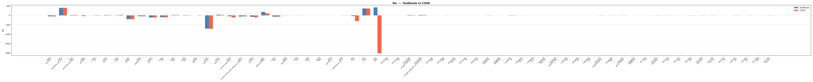

**Figure 2. Finish-stage setup total negative slack (TNS), FastRoute vs. CUGR.**

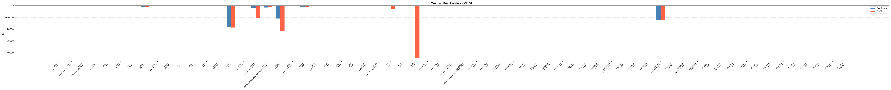

**Figure 3. Finish-stage hold worst slack (WS), FastRoute vs. CUGR.**

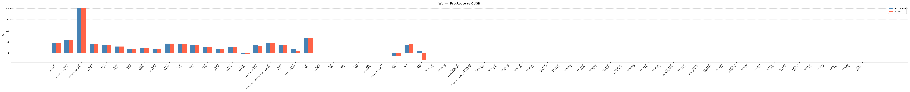

**Figure 4. Finish-stage hold total negative slack (TNS), FastRoute vs. CUGR.**

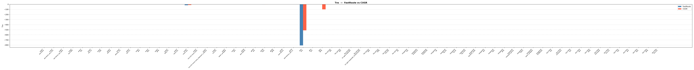

**Figure 5. Finish-stage Fmax, FastRoute vs. CUGR. Near-equivalent outside the gt2n outlier.**

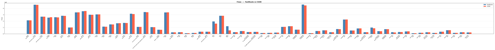

**Figure 6. Finish-stage total power, FastRoute vs. CUGR.**

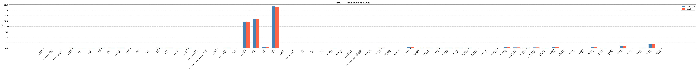

**Figure 7. Finish-stage internal power, FastRoute vs. CUGR.**

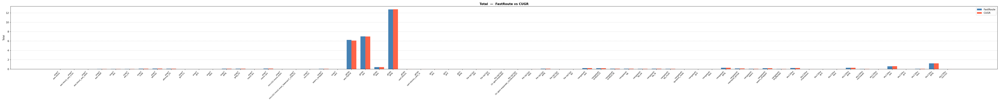

**Figure 8. Finish-stage switching power, FastRoute vs. CUGR.**

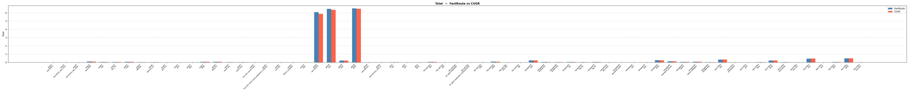

**Figure 9. Finish-stage total instance area, FastRoute vs. CUGR.**

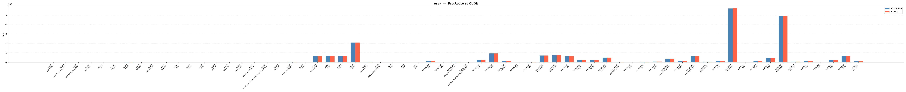

**Figure 10. Finish-stage placement utilization, FastRoute vs. CUGR.**

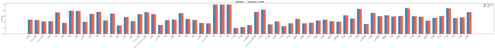

**Figure 11. Timing-repair buffer instance count, FastRoute vs. CUGR.**

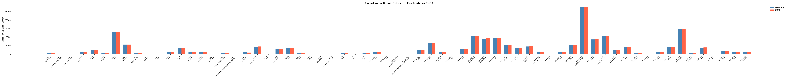

**Figure 12. Timing-repair buffer instance area, FastRoute vs. CUGR.**

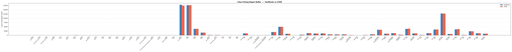

**Figure 13. Clock buffer instance count, FastRoute vs. CUGR.**

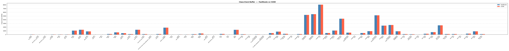

---

## 8. Challenges and Learnings

- Dangling pointers under ODB's synchronous callback model: the deferred-deletion queue used in an early version of #10578 looked safe in isolation but was a real hazard once ODB could reuse a pointer before the queue drained, a good reminder that "incremental" state in an ODB callback context has to be either fully synchronous or explicitly guarded, not just batched for convenience.
- Ordering of ODB callbacks matters more than it first appears: the pre vs. post-disconnect timing bug found in #10683 (refreshing CUGR before ODB had actually unlinked a terminal) would have silently produced incorrect guides rather than crashing, which is the more dangerous class of bug in this codebase and the reason the project leaned so heavily on golden-file regression tests rather than only pass/fail checks.
- VM/CI resource contention (flagged as a blocker in Week 8) and Jenkins remote-cache SSL flakiness (Week 3) cost real time but were outside the applicant's control; re-triggering and, later, reducing parallel build load were the practical mitigations.
- Apple Silicon / Rosetta 2 LTO linker crashes made local ORFS verification on the applicant's primary machine infeasible; moving to a cloud x86_64 instance (Lightning Cloud) resolved this and is recorded here for other contributors on ARM64 hosts.
- The gt2n regression in Section 7.3 was not caught until the final large-scale benchmarking sweep in Weeks 9 to 12, underscoring the value of running the full multi-PDK comparison earlier in the program rather than only at the end, noted as a process improvement for any follow-on work.

---

## 9. Future Work

- Investigate and fix the gt2n setup-timing regression (Section 7.3), likely requires tracing CUGR's cost-function behavior on this node's routing-resource profile specifically, since the same code performs well on every other node tested.
- Tune CUGR's incremental detour-penalty behavior to close the remaining setup-TNS gap versus FastRoute observed across most nodes (Section 7.2), which the current architecture attributes to the maze-routing detour stage rather than the queue/topology-refresh machinery delivered in this project.
- Complete `repair_antennas` integration for CUGR (flagged as "attempt if straightforward, else document as follow-on" in the original proposal); `GlobalRouter::repairAntennas()` still only hooks into FastRoute's `IncrementalGRoute` path.
- Update the incremental congestion-view refresh (GUI `dbGCellGrid` update) to traverse only dirty/secondary-net routing segments after an incremental CUGR pass, avoiding a full congestion-view rebuild, as originally scoped for Work Item 5 in the proposal.
- As explicitly agreed with the reviewer in PR #10648, remove the now-legacy `grt::add_dirty_net` Tcl/SWIG surface once GlobalRouter's dirty-net detection is fully integrated with CUGR's incremental path end to end (the bulk of this was completed in #10683; a final audit is recommended).

---

## 10. Acknowledgements

Thanks to mentor Eder Monteiro for detailed, iterative code review across all five PRs, in particular for catching the dangling-pointer hazard in #10578, insisting on the queue-and-execute model mirroring FastRoute in #9759, and for pushing for concrete regression-test coverage (`incremental_repair_cugr.tcl`) rather than log-only verification. Thanks also to the OpenROAD community's automated review tooling (Gemini Code Assist, Codex) for catching several real correctness issues, the pre/post-disconnect callback-ordering bug in #10683 in particular, before they reached master.

---

## 11. AI Tool Disclosure

In accordance with the OpenROAD GSoC AI usage policy: Claude (Anthropic) was used to assist with formatting and drafting of this final report document from the author's proposal, weekly logs, merged pull-request records, and benchmarking data/plots supplied by the author. Perplexity AI was used during pre-GSoC research to identify tooling for PR #9866. All code, technical reasoning, and implementation decisions across the five PRs described in this report are the author's own.

---

## 12. Links

- [PR #9671, Topology Refresh (updateNet)](https://github.com/The-OpenROAD-Project/OpenROAD/pull/9671)
- [PR #9759, Queue-and-Execute Refactor](https://github.com/The-OpenROAD-Project/OpenROAD/pull/9759)
- [PR #10578, Incremental Deleted-Net Cleanup](https://github.com/The-OpenROAD-Project/OpenROAD/pull/10578)
- [PR #10648, Regression Test for Deleted-Net Handling](https://github.com/The-OpenROAD-Project/OpenROAD/pull/10648)
- [PR #10683, Automatic ODB-Callback Wiring for CUGR + CI Log Fix](https://github.com/The-OpenROAD-Project/OpenROAD/pull/10683)
- [Applicant fork](https://github.com/sparsh-karna/OpenROAD)
- [OpenROAD repository](https://github.com/The-OpenROAD-Project/OpenROAD)
